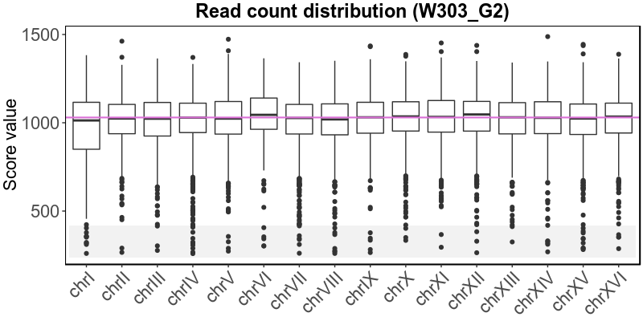
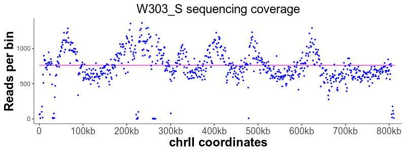
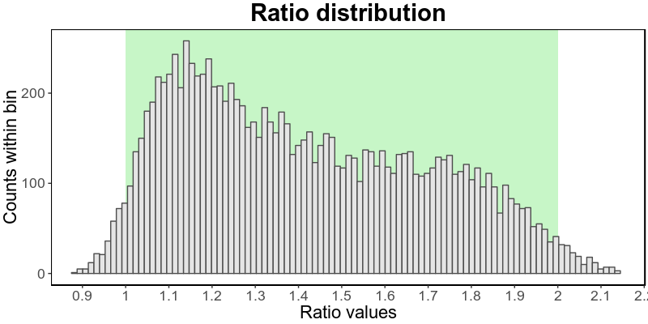
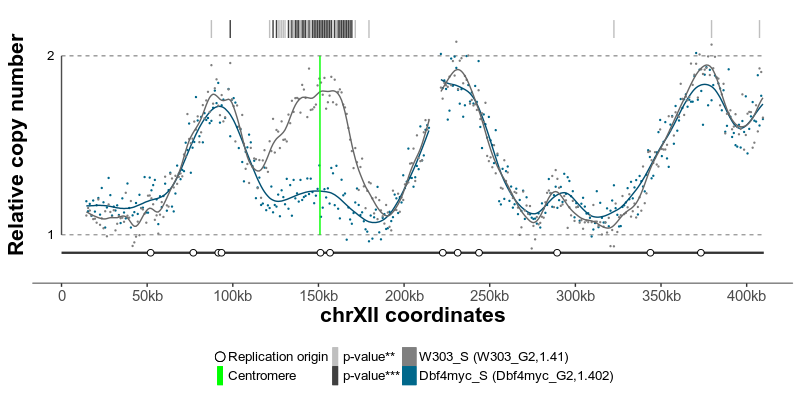

```{r setup, include = FALSE}
knitr::opts_chunk$set(
  collapse = TRUE,
  comment = "#>"
)
library(Repliscope)
```

Repliscope is an R package for creating, normalising, comparing and plotting DNA replication timing profiles. The analysis pipeline starts with BED-formatted read count files (output of [localMapper](https://github.com/DzmitryGB/localMapper)) obtained by high-throughput sequencing of DNA from replicating and non-replicating cells. There are three methods of measuring DNA replication dynamics using relative copy number (Fig.1): sort-seq, sync-seq and marker frequency analysis (MFA-seq). Sort-seq uses fluorescence-activated cell sorting (FACS) to enrich for non-replicating and replicating cells from an asynchronous population. Sync-seq requires cells to be arrested in non-replicating cell cycle phase (i.e. G1), followed by release into S phase. Samples are then taken throughout S phase when cells synchronously synthesise DNA according to the replication timing programme. In the case of MFA-seq, rapidly dividing cells in exponential growth phase are directly used as the replicating sample, while a saturated culture serves as a non-replicating control sample. While the latter approach of obtaining cells is the simplest, it also requires deeper sequencing due to decreased dynamic range and, thus, is more suitable for organisms with small genomes (typically, bacteria).


## Analysis overview

For best experience, use the Repliscope in interactive mode. To do so, simply run the *runGUI()* function.

The typical command line analysis using Repliscope starts with loading BED-formatted read count files using the `loadBed` function. Various functions allow removal of genomic bins containing low quality data (`rmChr`,`rmOutliers`). To aid read count analysis, two visualisation functions are used: `plotBed` and `plotCoverage`. Next, read-depth adjusted ratio of reads from the replicating sample to reads in the non-replicating sample is calculated using the `makeRatio` function; the resulting ratio values are distributed around one. The `normaliseRatio` function is then used to transpose the ratio values to a biologically relevant relative DNA copy number scale (typically, from 1 to 2). The normalised ratio values are, essentially, replication timing profiles, where low values indicate late replication and high values - early replication. The `plotRatio` function helps to visualise the ratio values as a histogram. Genomic bins containing unusually high or low ratio values may be removed using the `trimRatio` function. `smoothRatio` uses cubic spline to smooth replication profile data. `compareRatios` can be used to calculate difference between two replication profiles using z-score statistics. Finally, replication profiles are plotted using the `plotGenome` function, which also allows for various genome annotations.

_________________________________
## runGUI()
_________________________________
The `runGUI` function launches the package in interactive mode as a Shiny app. This is the recommended mode for the majority of applications.

### Usage
```
runGUI()
```

### Examples
```
runGUI()
```
_________________________________
## loadBed()
_________________________________
The `loadBed` function reads BED-formatted files into an R session. The BED format specifications can be found  at [UCSC](http://genome.ucsc.edu/FAQ/FAQformat). When read using this function, The [localMapper](https://github.com/DzmitryGB/localMapper) output BED files typically look like this:

```{r, echo=FALSE, results='loadBed'}
knitr::kable(head(Repliscope::W303_G2, 5))
```

The BED file fields may be separated by tabs or spaces. If the BED file contains a header, it will be ignored. If a genome dataframe is provided, only data for the chromosomes/regions within it will be retained (this may be used to split genomes containing many chromosomes into several plots). The resulting data is ordered by "chromStart" columns, retaining original chromosome order, unless a genome dataframe is provided.

### Usage
```
loadBed(file,genome,name)
```
* **file** Path to the BED file (string, required).
* **genome** A mask dataframe to exclude data from the BED file (dataframe, optional).
The genome dataframe must contain the 'chrom' column and may further contain 'chromStart' and 'chromEnd' columns, in this order.
* **name** A string to replace the 'name' column of the loaded BED file (string, optional).

### Examples
```
W303_G2 <- loadBed(system.file("extdata/W303_G2.bed",package="Repliscope"), name='W303_G2')

W303_G2_chrI <- loadBed(system.file("extdata/W303_G2.bed",package="Repliscope"), name='W303_G2',genome=sacCer3[["genome"]])
```
_________________________________
## rmChr()
_________________________________
A function to remove single chromosome data from a bed dataframe

### Usage
```
rmChr(bed,chr)
```
* **bed** A bed dataframe containing 'chrom' column (dataframe, required).
* **chr** Chromosome to remove (string, required).

### Examples
```
W303_S <- rmChr(W303_S,"chrM")
```
_________________________________
## rmOutliers()
_________________________________
A function to remove outliers from the "score" column of a supplied bed dataframe. There are three methods available: max, IQR and median. Max is used to remove 1 or more maximum values; IQR uses the **I**nter**Q**uartile **R**ange to detect outliers, while the median method can be used to remove data based on the genome-wide median.

### Usage

```
rmOutliers(bed,method,n=1,range=3,loLim=0.25,hiLim=NULL)
```
* **bed** A dataframe containing the 'score' column (dataframe, required).
* **method** Method to detect outliers: "max", "IQR" or "median" (string, required).
* **n** Number of max values to remove (integer, optional, defaults to 1). Use with "max" method.
* **range** Number of IQR above the 3rd or below the 1st IQR to set the threshold (double, optional, defaults to 3). Use with "IQR" method.
* **loLim** Low limit for the median method (double, optional, defaults to 0.25).
* **hiLim** High limit for the median method (double, optional).

### Examples
```
bedDF <- rmOutliers(W303_S,method="max",n=2)

bedDF <- rmOutliers(W303_S,method="IQR",range=3)

bedDF <- rmOutliers(W303_S,method="median",loLim=0.25,hiLim=2)
```
_________________________________
## plotBed()
_________________________________
A function to plot values in the ‘score’ column of the supplied bed dataframe, a boxplot per unique chromosome name in the ‘chrom’ column. The resulting plot also highlights outliers based on the interquartile range. The genome wide median is plotted as a pink line through the boxplots.

```
plotBed(W303_G2)
```


### Usage
```
plotBed(bed,plotting=TRUE)
```

* **bed** A dataframe containing 'score' and 'chrom' columns (dataframe, required).
* **plotting** Should the plot object be sent to the default device? (boolean, required, defaults to TRUE).

### Examples
```
plotBed(W303_S)

plotObject <- plotBed(W303_G2,plotting=FALSE)
```
_________________________________
## plotCoverage()
_________________________________
A function to create a scatterplot of values in the ‘score’ column of the supplied bed dataframe, along chromosome coordinates. The genome wide median is plotted as a pink line.

```
plotCoverage(W303_S,region='chrII:0-813136')
```


### Usage
```
plotCoverage(bed,region=FALSE,plotting=TRUE)
```

* **bed** A dataframe containing 'score','chrom','chromStart' and 'chromEnd' columns (dataframe, required).
* **region** Only plot for the provided region in the format 'chrI:1000-3000' (string, optional).
* **plotting** Should the plot object be sent to the default device? (boolean, required, defaults to TRUE).

### Examples
```
plotCoverage(W303_G2)

plotObject <- plotCoverage(W303_S,plotting=FALSE)
```
_________________________________
## makeRatio()
_________________________________
A function to calculate the 'score' ratio between two bed dataframes. It merges two supplied bed dataframes, calculates the ratios of their "score" values and normalises the ratios by the 'score' total sums.

``` {r ratioTable,echo=F}
knitr::kable(head(W303,5))
```

### Usage
```
makeRatio(bedRep,bedNonRep)
```
* **bedRep** Bed dataframe containing read counts from a replicating sample (dataframe, required).
* **bedNonRep** Bed dataframe containing read counts from a non-replicating sample (dataframe, required).

Both bed dataframes must contain "chrom","chromStart", "chromEnd" and "score" columns.

### Examples
```
ratioDF <- makeRatio(W303_S,W303_G2)
```

_________________________________
## normaliseRatio()
_________________________________

A function to normalise ratio values to fit a biologically relevant scale. It scales values from the 'ratio' column of the provided dataframe either using a supplied 'rFactor' value or automatically to best fit the scale from one to two.

### Usage
```
normaliseRatio(ratioDF,rFactor=NULL,replace=TRUE)
```
* **ratioDF** A ratio dataframe containing the 'ratio' column (dataframe, required).
* **rFactor** Value to normalise by, related to replication progression (numeric, optional).
* **replace** Should the existing 'ratio' values be overwritten or stored in a new 'tmpRatio' column (boolean, required, defaults to TRUE).

### Examples
```
ratioDF <- normaliseRatio(W303)
ratioDF <- normaliseRatio(W303,rFactor=1.41,replace=FALSE)
```
_________________________________
## plotRatio()
_________________________________
A function that plots a histogram of values in a supplied vector using ggplot2 and highlights the interval between 1 and 2 in green.

```
plotRatio(W303norm$ratio)
```

### Usage
```
plotRatio(ratio,plotting=TRUE)
```
* **ratio** A numeric vector containing raw or smoothed ratio values (numeric vector, required).
* **plotting** Should the plot object be sent to the default device? (boolean, required, defaults to TRUE).

### Examples
```
plotRatio(W303$ratio)
plotObject <- plotRatio(W303$ratio,plotting=FALSE)
```
_________________________________
## trimRatio()
_________________________________
A function to remove outliers from the "ratio" column of a supplied ratio dataframe.

### Usage
```
trimRatio(ratioDF,loLim,hiLim)
```
* **ratioDF** A ratio dataframe containing the 'ratio' column (dataframe, required).
* **loLim** Low limit threshold (double, required).
* **hiLim** High limit threshold (double, required).

### Examples
```
W303 <- trimRatio(W303,0.5,1.5)
```
_________________________________
## smoothRatio()
_________________________________
A function to smooth ratio values using a cubic smoothing spline.
The `smoothRatio` function splits values from the 'ratio' column by chromosome and based the supplied *groupMin* and *split* parameters and then applies the `smooth.spline` function from R stats package. The supplied dataframe may contain multiple ratios, i.e. ratios produced using multiple replicating samples and/or multiple non-replicating samples. This must be reflected in the 'name.rep' and 'name.nonRep' columns. In other words, different ratio dataframes may be merged using the `rbind` function before calling the `smoothRatio` function.

### Usage
```
smoothRatio(ratioDF,groupMin=5,split=5)
```
* **ratioDF** A ratio dataframe or combined ratios dataframe containing the 'ratio' column (dataframe, required).
* **groupMin** Minimum number of values required to make a group (integer, required, defaults to 5).
* **split** Minimum number of adjacent bins with missing values to close current group (integer, required, defaults to 5).

### Examples
```
ratioDF <- smoothRatio(W303norm)

ratioDFs <- smoothRatios(rbind(Dbf4myc,W303norm))
```
_________________________________
## compareRatios()
_________________________________
A function to compare two replication profiles. 
`compareRatios` takes two ratio dataframes that were binned the same way and uses z-score statistics to find p-values of their differences. The function outputs a combined dataframe containing the two input ratio dataframes in a long format with an added 'p.value' column.

### Usage
```
compareRatios(ratio1,ratio2)
```
* **ratio1** Ratio dataframe, or a string containing name of a ratio dataframe (dataframe or string, required).
* **ratio2** Ratio dataframe, or a string containing name of a ratio dataframe (dataframe or string, required).

### Examples
```
ratioDFs <- compareRatios(W303norm,Dbf4myc)
```
_________________________________
## plotGenome
_________________________________
`plotGenome` plots scatterplot/barplot/polygon of the 'score' and/or the 'splineSmooth' column values by genomic coordinates, either for the whole genome or a specified region. It also allows annotation with additional BED-formatted data.

```
plotGenome(sortSeq,region='chrXII:0-410000',lines=sacCer3[["cen"]],circles=sacCer3[["ori"]])
```


### Usage
```
plotGenome(ratioDFs, geom="geom_point", ylims=c(1,2), plotting=TRUE,
           genome=NULL, region=FALSE, guide=NULL,
           lines=NULL, circles=NULL, rectangles=NULL, pointers=NULL,
           colourLines='#00FF00', colourCircles='#FFFFFF', colourRectangles='#FF0000', colourPointers='#FF7F00'
           )
```

* **ratioDFs** A ratio dataframe or combined ratios dataframe containing 'ratio' column (dataframe, required).
* **geom** ggplot2 geom to use for plotting: "geom_point","geom_ribbon" or "geom_segment" (string, required, defaults to "geom_point").
* **ylims** A vector of two values for y axis limits - first is lowest, second is highest (numeric vector, required, defaults to 1 and 2)
* **plotting** Should the plot object be sent to the default device? (boolean, required, defaults to TRUE).
* **genome** A mask dataframe to exclude data from the ratio dataframe (dataframe, optional).
#' The genome dataframe must contain "chrom","chromStart" and "chromEnd" columns.
* **region** Only plot the provided region in the format 'chrI:1000-3000' (string, optional).
* **guide** A dataframe guiding the plotGenome function how to plot the data (dataframe, optional).
The guide dataframe must contain the following columns: 'order' (*integer*) - order to plot data, 'name.rep' (*character*) - replicating sample name that matches the one in the ratioDFs dataframe, 'name.nonRep' (*character*) - non-replicating sample name that matches the one in the ratioDFs dataframe, 'raw' (*logical*) - should the raw raw data be plotted, 'smooth' (*logical*) - should the smoothed data be plotted, 'color'(*character*) - R colour to plot the current sample, both raw and smoothed data.
* **lines** Additionally plot vertical lines from a BED formatted dataframe (dataframe, optional).
* **circles** Additionally plot circles on the chromosome line from a BED formatted dataframe (dataframe, optional).
* **rectangles** Additionally plot rectangles on the chromosome line from a BED formatted dataframe (dataframe, optional).
* **pointers** Additionally plot downward pointing triangles from a BED formatted dataframe (dataframe, optional).
* **colourLines** Colour for 'lines' data (string, required, defaults to green).
* **colourCircles** Colour for 'circles' data (string, required, defaults to white).
* **colourRectangles** Colour for 'rectangles' data (string, required, defaults to red).
* **colourPointers** Colour for 'pointers' data (string, required, defaults to orange).

### Examples
```
plotGenome(sortSeq,genome=sacCer3[["genome"]],lines=sacCer3[["cen"]],circles=sacCer3[["ori"]])

plotGenome(sortSeq, geom="geom_ribbon", guide=guide,region="chrIX:250000-439885", lines=sacCer3[["cen"]], circles=sacCer3[["ori"]])

plotGenome(syncSeq[["data"]], geom="geom_segment", guide=syncSeq[["guide"]], genome=sacCer3[["genome"]], lines=sacCer3[["cen"]], circles=sacCer3[["ori"]], colourLines="black")
```
